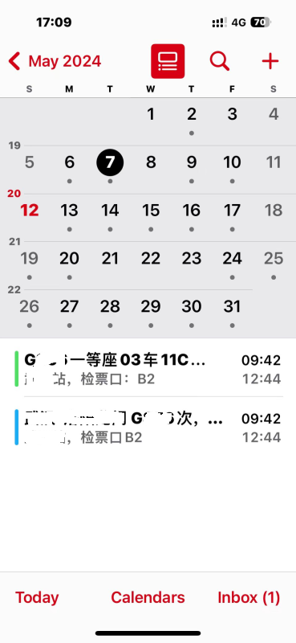
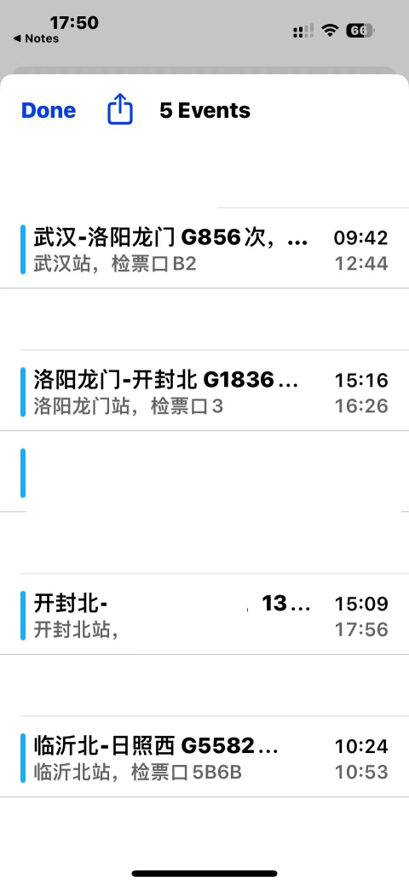

# 12306Calendar

## 修改
1. 通过api拉取信息，加入到站时间
2. 加入地点，为出发站+站台

## 还需进一步修改
1. 加入出发和到站闹钟

## 效果

1. 在 12306 上买完票之后，会在iPhone 日历上展示车次关键信息
2. 可以配置在发车前多少小时提醒自己
3. 

## 背景

每个月都需要在 12306 app 上提前订多张往返“北京<->天津”的票，但在 12306 app 上查看订单，排序竟然是按照购买日期买票的顺序，没有按照发车日期进行排序，查找起来特别费劲。

## 思路

iPhone 订阅日历功能 -> 请求自己写的服务 -> 模拟登录邮箱 -> 获取最近30天 的 12306 邮件 -> 解析邮件内容得到车次信息 -> 返回 ics 日历格式的内容 -> 订阅日历成功 -> 手机日历视图上展示订票信息。

## 使用

1. 步骤

设置->密码与账户（**iOS 14: 邮件->账户**）->添加账户->其他->添加已订阅的日历 -> 服务器地址（ip+ 参数）-> 下一步 -> 完成

2. 服务器地址: http://49.232.159.245:8080/?u=邮箱地址&p=客户端授权码
   1. u(**必填**): 12306 绑定的邮箱地址
   2. u(**必填**): 客户端授权码
   3. h(*选填*)：默认提前 1 小时提醒，如果想提前2小时，需增加参数&h=2
   4. 此服务为原作者提供，我仅在本地运行
3. 效果

## 开发

1. 终端执行：python3 server.py
2. 在 Mac Safari 上输入： http://127.0.0.1:12306?u=xxx&p=xxx
3. 原作者端口为8080，我改为了12306以免冲突
4. 也可以在iPhone Safari 上调试：输入本地电脑的 ip 与相关参数，效果如下

